#  Avatar Crates

Avatars alter the player's appearance, size, strength and speed.

Watch a step-by-step [Custom Avatar Import Guide on YouTube](https://youtu.be/nH7HB7u7GtM) that covers the basics or follow the written guide below that goes into greater depth.

- [Avatar Requirements](#avatar-requirements)
- [Preparing A Model for Import](#preparing-a-model-for-import)
- [Importing A Model](#importing-a-model)
- [Turning the FBX into a Prefab](#turning-the-fbx-into-a-prefab)
- [Always Apply Prefab Overrides](#always-apply-prefab-overrides)
- [Completing the Avatar Script](#completing-the-avatar-script)
- [Fine-Tuning the Avatar](#fine-tuning-the-avatar)
- [Adding Custom Sounds](#adding-custom-sounds)
- [Creating an Avatar Crate for use in a Mod](#creating-an-avatar-crate-for-use-in-a-mod)

#### Avatar Requirements
* Bonelab Avatars use the Unity Mecanim Animation System
* The Avatar must be a Humanoid and requires the following Rig bone structure:
   * Two Eyes **or** No Eyes and an `Eye Center Override` transform
   * Bones shown with blue dots are *optional*
   * All other bones are **required** even if they are listed as optional in Unity

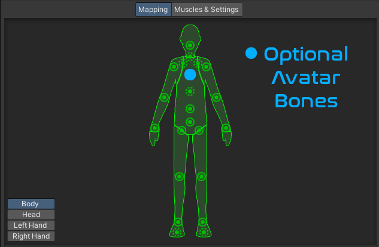 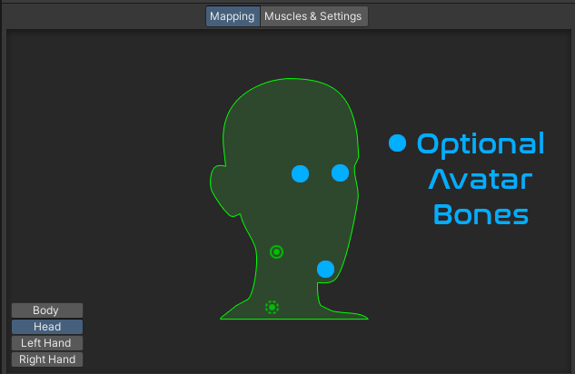 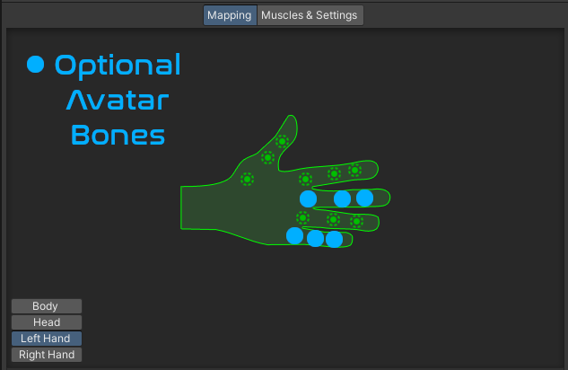

## Preparing a Model for Import

1. Before importing the desired model into Unity, you will want to open it in Blender, Maya or similar 3D application to verify that the rig is complete and is properly weight-painted.  To check this, enter Pose Mode and make sure the mesh and rig move as expected as you manipulate the model's pose.  If not, adjust the rig as necessary.  Doing so is beyond the scope of this guide, but plenty of rigging and weight painting tutorials exist for deeper guidance.  Be on the lookout for bones that have odd scaling or rotations.

### Troubleshooting Tip
**Help!  My Avatar's Fingers Look Like They Were Run Through A Meat Grinder In-Game But Look Fine In Blender/Unity!!**

This has been one of the most common Avatar import problems.  Troubleshooting this issue prior to the FBX Export step is recommended as changes to the rig must be made in 3D software like Blender.  These steps cannot be taken in Unity.

Examine the Local Bone Rotations of all hand and finger bones:
   1. Open Blender and import the FBX. 
   2. Switch to either the `Layout` or `Modeling` Tab, then use the pull-down to enter `Pose Mode`.

   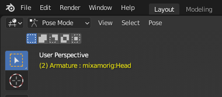

   3. Select the Armature in the Collection
   4. Click the `Object Data Properties` tab on the right and then Enable the `Axes` checkbox and ensure the `Display As` drop-down is set to *Octahedral*.  This will overlay the Axis rose for each bone, allowing you to view its local rotation.  

   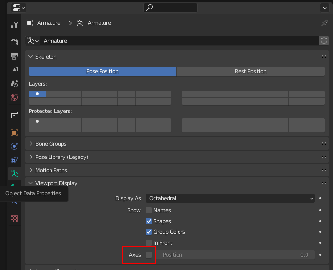

The axes of hands and fingers *must be consistent* with the arm bones, like so:
   1. Ensure the model is in a T-pose.  
   2. If your model does not automatically enter a T-Pose when entering `Pose Mode` in Blender, the Armature will need to be reworked manually or using various automatic T-Pose tools. 
   3. *A-Pose models will likely encounter problems.*  The default Pose in Blender should show bones within 45 degrees of a proper T-Pose.  Limbs that are rotated more than 45 degrees from being perpendicular with the body may appear *sideways* in-game.
   4. Adjust finger bones so that they are consistently similar to the arms and hands.  The slight exception to this is the thumb, which will be flexed out and slightly rotated away from the rest of the fingers.  However, the overall axis orientation should still conform with the rest of the finger bones.  If the arm has +Z pointing downward, the fingers and thumb should have +Z pointing downward.  If +Y is pointing from the shoulder toward the fingers in the arm bone, the hand and fingers should also have Y+ pointing toward the finger tips.  Regardless of your 3D software's or model's axis convention, consistency is the key.  
   5. Hand poses mimic human-ish hand proportions, so if the rigging of a model's hand vastly differs from relative human hand proportions, visual oddities can occur.  Issues may arise with extremely long (E. Scissorhands) or short fingers (Symbrachydactyly) relative to the model's hand proportions.  

(Click image to see its full-size version, use the browser Back button to return)
[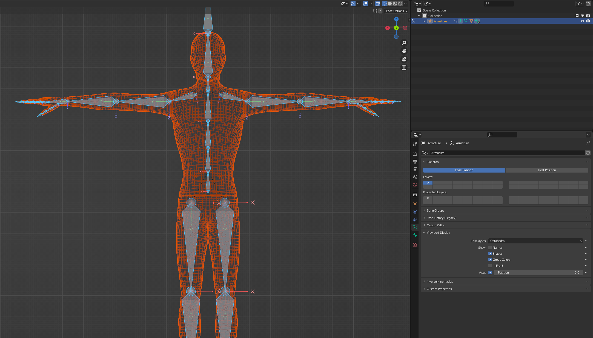](./Images/Avatar/avatar_bone_rotation_consistency_front.png)

(Click image to see its full-size version, use the browser Back button to return)

(Click image to see its full-size version, use the browser Back button to return)
[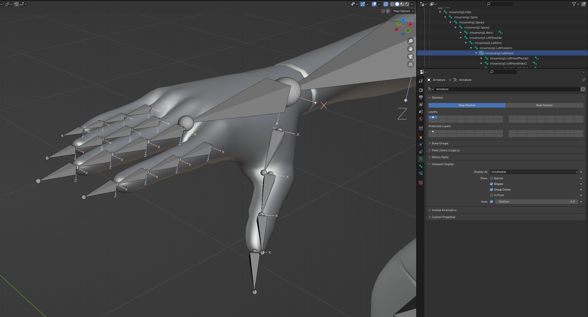](./Images/Avatar/avatar_bone_rotation_consistency_rt.png)

Many models from external sources will include tons of extra bones well beyond the Mechanim requirements.  If the rigging in Blender or in Unity does not look similar to the above images (extra bones between the hand and thumb, multiple rats-nest-like connections between the wrist/hand and fingers, etc.), it is probably a good idea to re-rig the hand or even the entire model.  Thankfully, tools likle Blender's Rigify or Mixamo's auto-rigging work well for this.

2. Try to do any required scaling of the rig and model within the 3D application so that the scale of the Avatar and all of its sub-items (meshes and bones) can be left at a (1,1,1) scale in Unity.  While Unity can handle *small* scale changes (**only to the Prefab root!**) that alter the original FBX scale, large changes can cause unexpected behavior.  

It is recommended to export the rigged model using the FBX format as the Autodesk Filmbox format is readily handled by Unity and contains animation and model geometry data.

3. When exporting a FBX file from Blender to import into Unity, use the following settings:
* Apply Scaling: `FBX All`
* Uncheck `Add Leaf Bones`

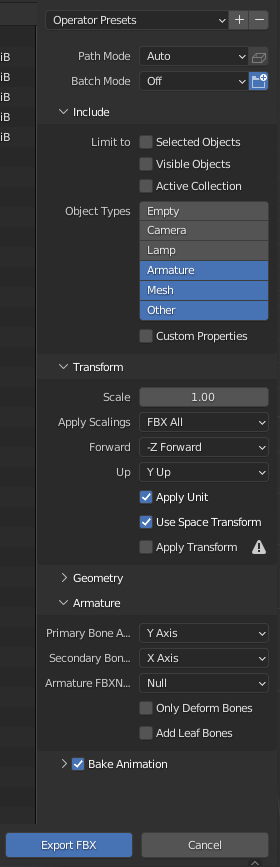

## Importing a Model

1. Import the desired avatar into the Unity project.  This is typically a .fbx file that has ideally been exported using the [Preparing a Model](#preparing-a-model-for-import) steps listed above.    

It is recommended to place each avatar .fbx into its own folder as a later step will extract its textures and add extra files and folders alongside the .fbx file.  

2. Select the FBX from the Project window.  

### The Model Tab

* Scale Factor: Leave Scaling alone unless there is a specific, understood need to change it 
* Enable checkboxes for `Convert Units`, `Blend Shapes`, `Weld Vertices`, `Legacy Blend Shape Normals` and diasble all others.  If the model becomes an odd size (compare with a standard Unity 1m cube), uncheck Convert Units to see if the model is a proper size.

### The Animation Tab

* Adjust the Animation tab to the following options:

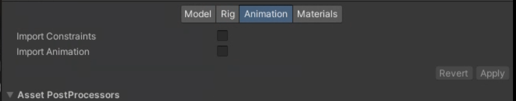

### The Rig Tab

1. In the `Rig` tab in the Inspector
* Set *Animation Type* from Generic to **Humanoid** 
* Ensure Avatar Definition is `Create From This Model`
* Skin Weights: `Standard 4 Bones`
* Keep the `Strip Bones` checkbox enabled ( except in rare cases)

If Unity is unable to automatically map the bones, click the `Configure` button on the `Rig` tab and manually map the bones to their appropriate fields.

**Rig with No Eye Bones and Full Hands**

  

**Rig with Eye Bones and Partial Hands**

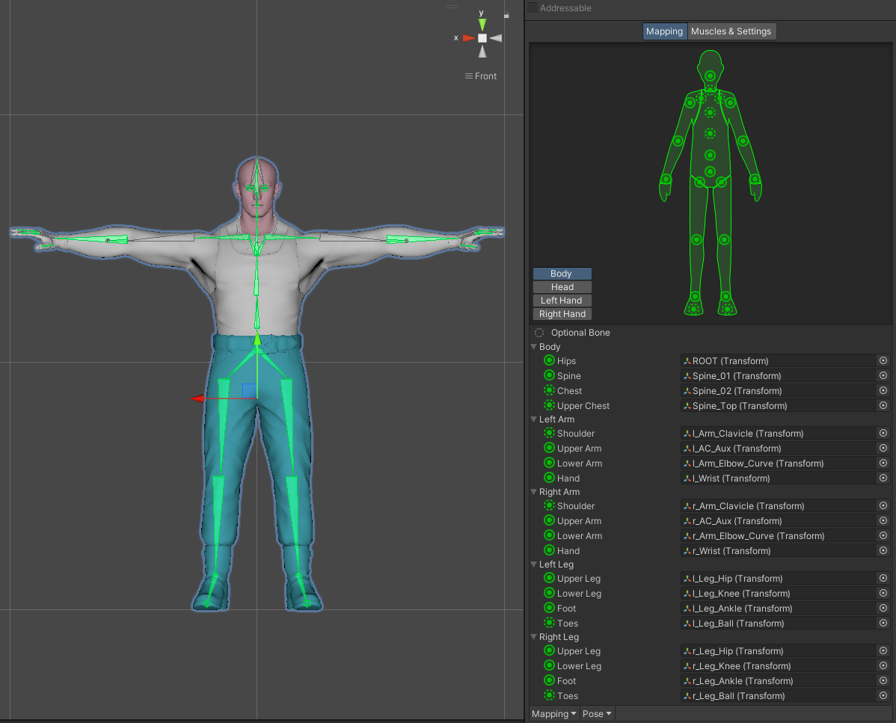  

### The Materials Tab

3. Click the `Materials` tab in the Inspector.

4. If no materials are visible on the Avatar but they are embedded within the FBX, temporarily choose *Use External Materials (Legacy)* from the `Location` dropdown menu.  This will automatically extract textures and materials into the folder with the .fbx and assign them to the model.  

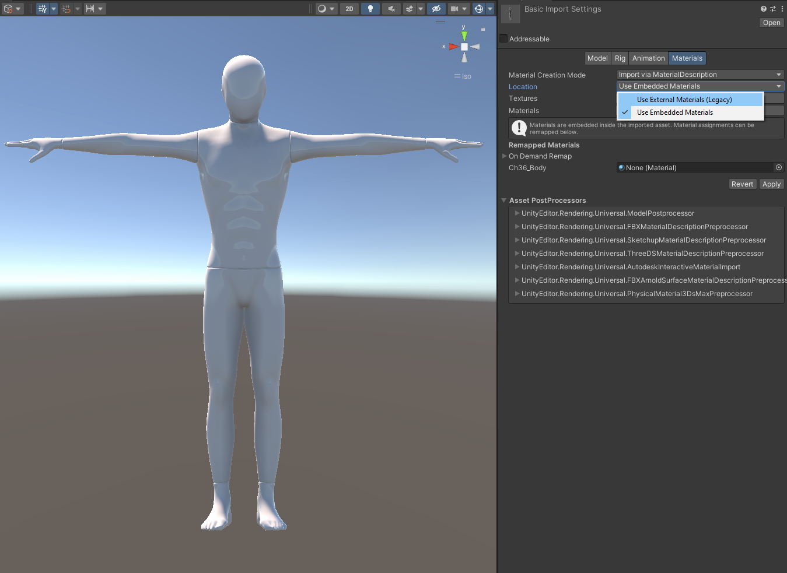

5a. When choosing the *Use External Materials (Legacy)* option, Unity may prompt about the need to fix the model's NormalMap.  Click Fix Now.

(Click image to see its full-size version, use the browser Back button to return)
[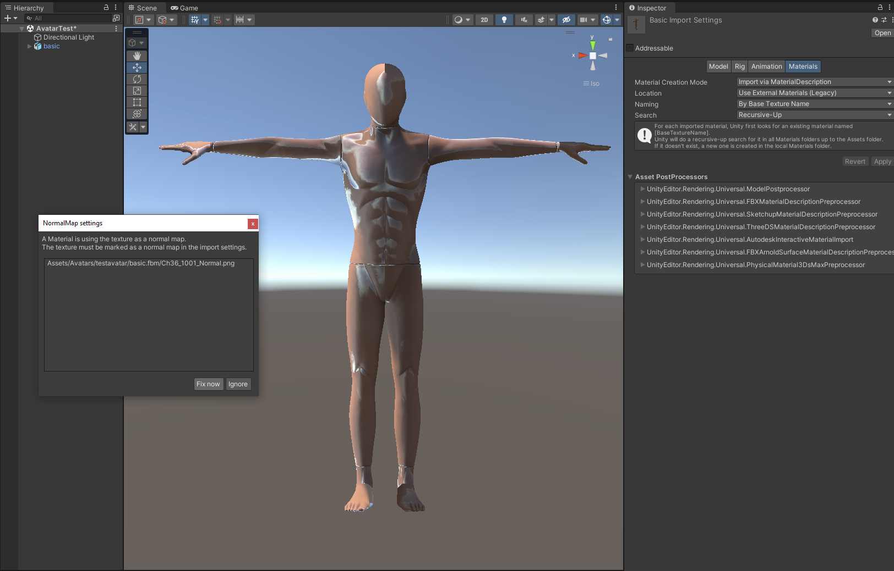](./Images/Avatar/avatar_basic_normalmapfix.png)

### Troubleshooting Tip
A common issue when importing an Avatar is the use of custom shaders that are incompatible with the Universal Render Pipeline.  This often leads to an Avatar that shows up above the Body Mall as a small preview but is invisible or does not seem to activate in-game.

**Be sure that the Shader for any materials is set to** `Universal Render Pipeline/Lit (PBR Workflow)`.

5b. If no materials are visible on the Avatar but the textures are available externally and are broken up per mesh, copy them into a Textures subfolder of the FBX file's location.
* Create a new Material in unity for each texture/mesh and apply the Diffuse texture into the Base Map slot of the Material, Normal map into the Normal Map slot, etc.

6. Recommended: Change the `Material Creation Mode` to *None*.  

* This step may seem extreme and tedious, but using the textures embedded or in the FBX or mapped to it by Unity *as-is* can bloat the avatar build size with unneeded shader variants and can create dependency references in the FBX prefab that may drag unused textures into the bundle.

7. Manually (re)apply the materials to each mesh of the model by dragging and dropping them onto the appropriate mesh in the Scene view or into the Materials section of the Inspector.
8. Delete all unused textures and materials.

9. If the model being imported came from VRChat, VRoid, SFM or other similar source, double-check and remove any scripts that might exist in the FBX's hierarchy as they are likely to cause compatibility issues or errors.  

## Turning the FBX into a Prefab

1. Create a GameObject out of the FBX by dragging the FBX from the Project Window into the Scene view and reset the position of the GameObject's Transform to ensure it is at the origin (0,0,0).  
2. Turn this GameObject into its own Prefab by dragging it back into the Project Window.  If prompted between creating a Variant or an Original Prefab, select *Prefab Variant*.
3. Open the Prefab by selecting it in the hierarchy and then clicking Open Prefab in the Inspector. This will allow direct editing of the prefab's contents.

# Always Apply Prefab Overrides 
**If you do not edit the Prefab directly and prefer to make changes to the GameObject, be sure to Apply any Prefab overrides as you work.  Changes to the GameObject in the hierarchy do *not* get automatically applied to the Prefab that will be referenced by the Avatar Crate!**  

Put another way, you do not need the Avatar in the Scene... only the object in the Project window is used by the Avatar Crate, so be sure any Override changes made in the hierarchy have been Applied to the Prefab before you Pack your Pallet or delete the GameObject from the scene to avoid loss of work.

## Completing the Avatar Script

1. Add an [Avatar](AvatarScript) script to your Avatar Prefab.  Detailed setup of the Avatar script is available [here](AvatarScript), but only a few fields are required to get an Avatar imported into Bonelab.
2. At a minimum, add at least one element to the *Body Meshes* list and select the model's Skinned Mesh Renderer.  If the model has seperate *Head* or *Hair* meshes, add those to the appropriate list.
3. While most of the typical Mechanim bones must be in the Rig (Head, Hands, Toes, Chest, etc.), the *Wrist bones* are the only bones needed by the Avatar Script to provide basic in-game functionality.  However, many models do not have specific *Wrist* bones, so use the bone that best fits (a model's *Hand* bone usually works well for the *Wrist* field).  
4. Avatars that lack any of the required bones or have empty Wrist fields in the Avatar script will display a large red dot near their mesh in Scene View.  This will be common for models that do not have *Eye* bones.  A red dot will be displayed until an `Eye Center Override` is provided.

(Click image to see its full-size version, use the browser Back button to return)
[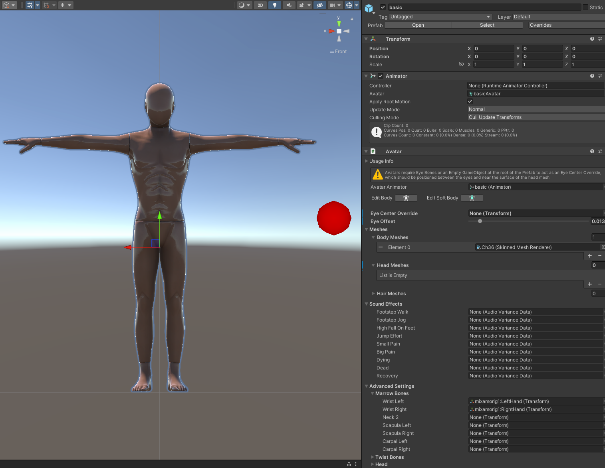](./Images/Avatar/avatar_basic_minimum_fields_noeyeoverride.png)

5. If no Eye Bones exist, create an `Eye Center Override` by adding an `Empty GameObject` to the root of the Avatar prefab.  Position the "EyeCenterOverride" GameObject at the front of the model's face, between its eyes.

(Click image to see its full-size version, use the browser Back button to return)

## Fine-Tuning the Avatar

1. Once all required bones and eye override (if needed) are in place, a set of gizmos, appearing as elipses and dots will be displayed around the model.

(Click image to see its full-size version, use the browser Back button to return)
[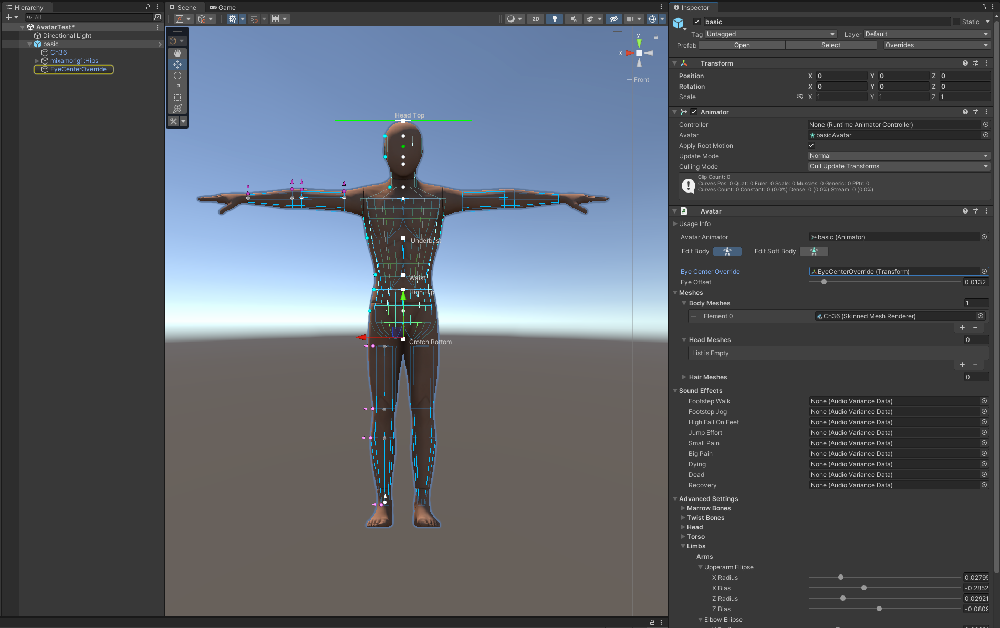](./Images/Avatar/avatar_basic_eyeoverride.png)

2. Click `Edit Body` and adjust the gizmos by clicking and dragging the dots until they roughly line up with the countours of the avatar's mesh.  Getting these gizmos to closely fit the model will avoid visual clipping issues in-game.
3. Click `Edit Soft Body` to adjust the handles used for the preview soft-body system for breasts.  This system will eventually include the abdomen, groin, upper/lower back and butt.
4. Adjust the `Eye Offset` as needed to bring the green dot forward enough so that it does not clip inside the head geometry.  This indicator acts like the player's "camera"/viewpoint.

## Adding Custom Sounds

1. Expand the **Sound Effects** section of the Avatar script

(Click image to see its full-size version, use the browser Back button to return)
[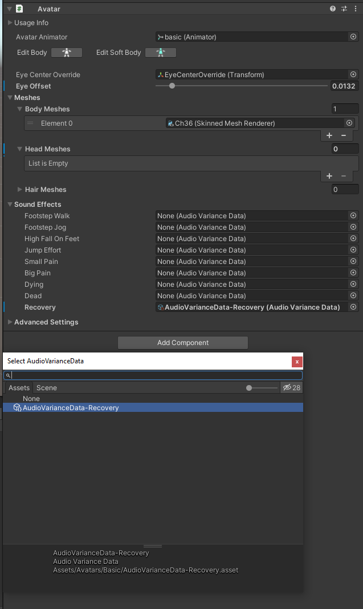](./Images/Avatar/audiovariancedata_avscript.png)

2. Navigate to the folder of your Avatar in the Project Window.  
3. Copy in sound file formats recognized by Unity into the Project window, which include `.wav, .ogg, .mp3` files.  If you have several files, you may want to place them into a subfolder of your Avatar's FBX and prefab files to stay organized.  
4. Right-click an empty area of the Project window within the folder that contains the sound clips and select `Create` -> `MarrowSDK` -> `Audio Variance Data`.  This will create an `AudioVarianceData` object with an *Audio Clips* list.  

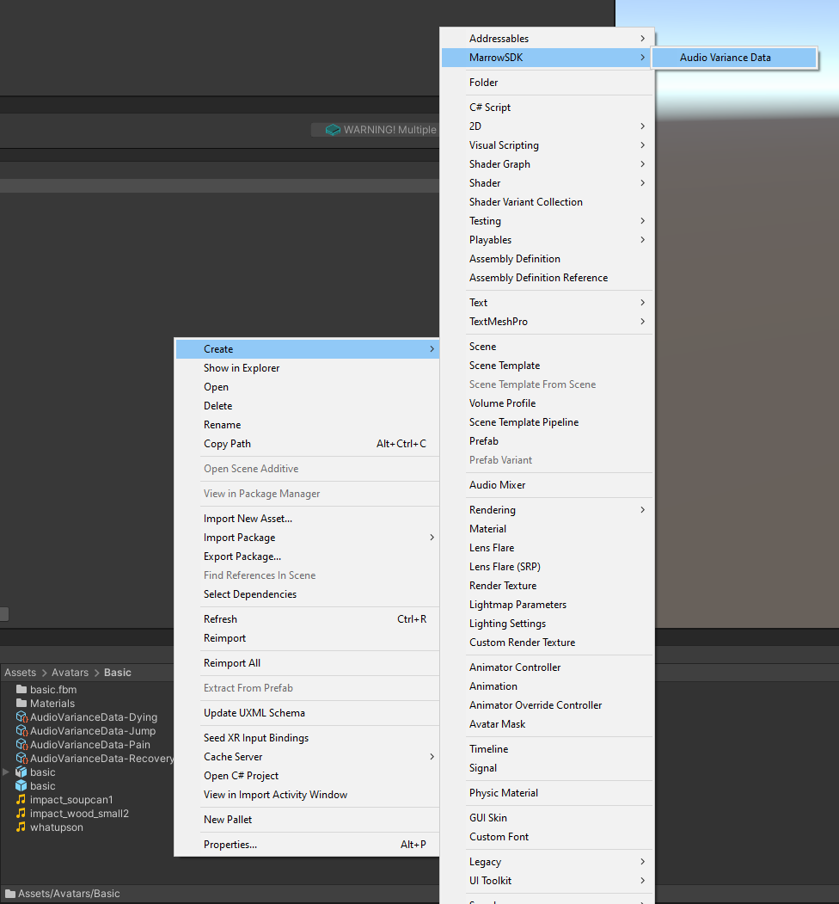

Alternatively, you can add `Audio Variance Data` objects from the `Assets` -> `Create` -> `MarrowSDK` -> `Audio Variance Data` menu.

5. Add a separate `Audio Variance Data` object for each type of sound event, as shown below:

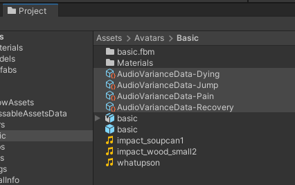

5. For each `Audio Variance Data` object, add element(s) to the *Audio Clips* list and drag in the desired sound clips (.wav, .ogg, .mp3, etc.).  Adding more than one element to the list will add variants to the sounds that weil be randomly played whenever the sound event is triggered.  For example, having multiple pain or footstep sounds is highly recommended so that the same exact sound is not played every single step or every time the player is injured.

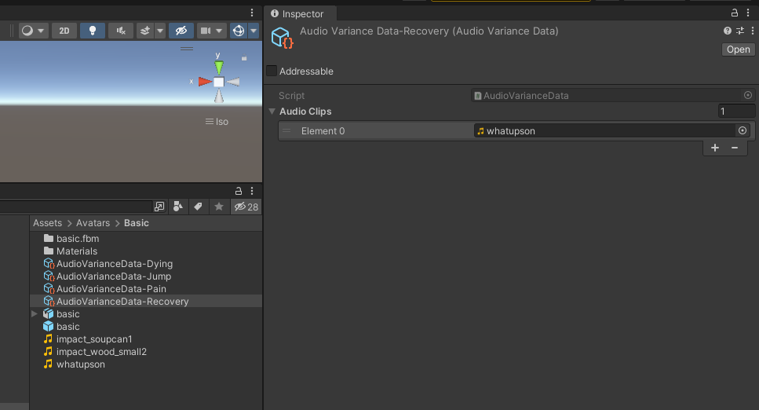  

6. Place the `Audio Variance Data` objects into the appropriate **Sound Effects** field of the Avatar script.

## Creating an Avatar Crate for use in a Mod

# Be sure to Apply any Prefab overrides before packing your Pallet!
**Changes that override the Prefab are only relevant to the GameObject in the hierarchy and will *not* be reflected in the Prefab referenced by the Avatar Crate!**

1. Select the Pallet in the Asset Warehouse (Stress Level Zero -> Void Tools -> Asset Warehouse if the AW is not visible).
2. Click `Add Crate` in the Pallet's Inspector.
3. Select the `Avatar Crate` type from the dropdown menu, provide a Crate Title and select the Avatar prefab as the Asset Reference.

(Click image to see its full-size version, use the browser Back button to return)
[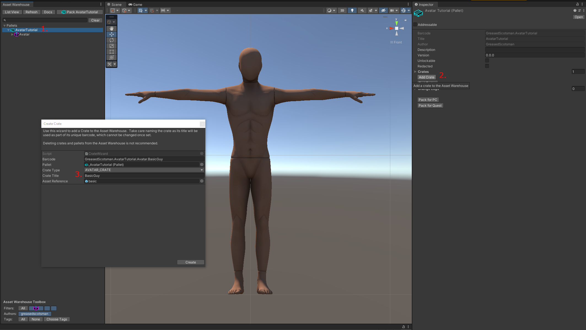](./Images/Avatar/avatar_basic_addcrate.png)

4. Select the added Avatar in the Asset Warehouse and click `Generate Packed Assets` to create a rough preview of the model.  
5. Pack the Pallet into a mod using the `Pack (Pallet Name)` button in the Asset Warehouse or by selecting the Pallet in the Asset Warehouse and clicking `Pack Pallet`.
6. In the File Explorer window that appears, copy the folder into your Bonelab `Mods` folder.  
   * The PC default is `C:\Users\[username]\AppData\LocalLow\Stress Level Zero\BONELAB\MODS`.  
   * If installing locally to Quest 2, connect the headset with a Link cable, `Allow Files` from the connected device when prompted in the headset, then on the PC, navigate to:  
   `This PC\Quest 2\Internal shared storage\Android\data\com.StressLevelZero.BONELAB\files\Mods` 
   and copy the folder generated during the Pack Pallet process to it.
7. Launch the game, enter a map other than Main Menu, bring up the Avatars menu by holding B or Y and selecting `Avatars`, then select your custom Avatar.

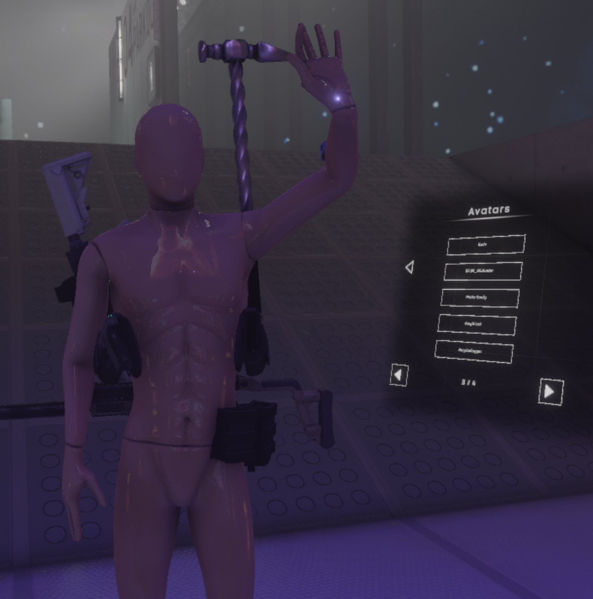

