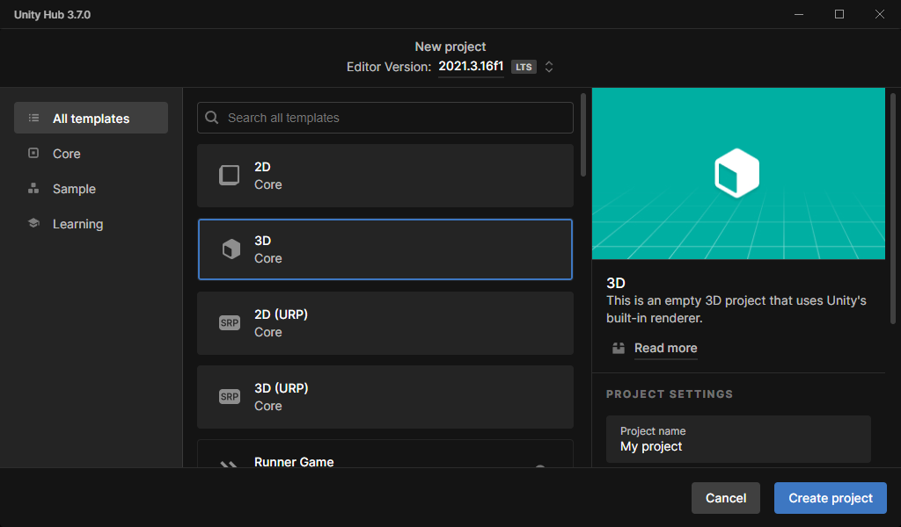
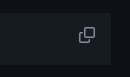
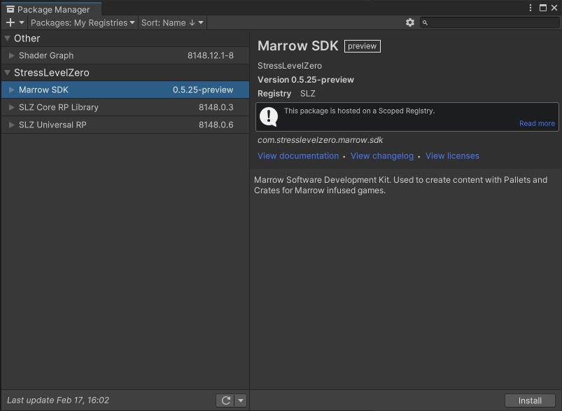

# Project Setup

Requirements
---
* Unity Version `2021.3.16f1`
  * Only SLZ-URP compatible shaders will render properly
* Basic Unity Knowledge

Project Setup
---
Watch the step-by-step <b>MarrowSDK [Project Setup Guide](https://www.youtube.com/watch?v=U5jynJcDjvo)</b>, the <b>[Getting Started Guide](https://www.youtube.com/watch?v=M4B0TOG-b94)</b> on YouTube or follow the written guide below.


## Download and Install Unity

- Download [Unity Hub](https://unity.com/download). 
- If you already have Unity Hub installed (recommended), you can quickly install Unity version `2021.3.16f` by copying the following unityhub link into a browser: `unityhub://2021.3.16f1`.  The [Unity Hub](https://unity3d.com/get-unity/download) is recommended to help manage different versions of Unity and multiple projects.  Otherwise, [download](https://unity3d.com/get-unity/download/archive) Unity `2021.3.16f` manually from the Unity Archives. 
- When installing Unity `2021.3.16f`, be sure to include the following modules: Under <b>Platforms</b>, select *Android Build Support* and it's sub-items, *Android SDK & NDK Tools* and the *OpenJDK*.  Lower down the list, add *Windows Build Support (IL2CPP)*.

 

- Once Unity is installed, create a <b>New Project</b>.  If you have other Unity Editor versions, be sure to select `2021.3.16f` from the list at the top of the window. 


- Create a new `3D Core` project for your mod. (Note this change from older MarrowSDK versions... do <i><b>not</b></i> choose 3D (URP))  

## Add the SLZ Scoped Registry

- Select `Window` → `Package Manager` → `Gear Icon` → `Advanced Project Settings`


#### Copy each line into the new scoped registry


> [!IMPORTANT]
>  Use the copy button on the right of each line to avoid errors

> Name 
```
SLZ
```
> URL
```
https://registry.stresslevelzero.com
```
> Scopes
```
com.stresslevelzero
```
```
com.unity.render-pipelines
```
```
com.unity.shadergraph
```
- Click Save.

Next, be sure `Packages: My Registries` is selected in the Project Manager Window and select `Marrow SDK` under the <b>Stress Level Zero</b> menu.



- Click Install.  This will install all three <b>Stress Level Zero</b> packages.  Please be patient as this process may take some time.

- That's it!  No manual verification process is required.
