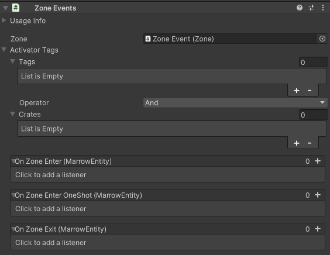
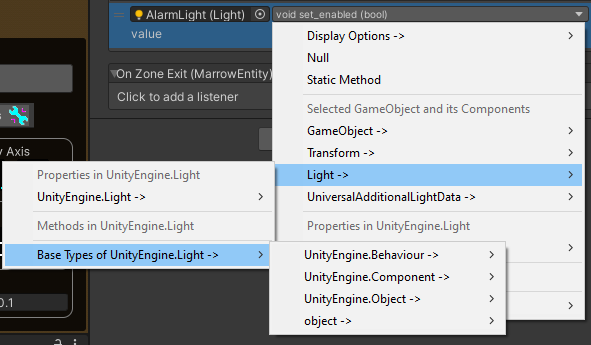

#  Zone Events

 <a href="https://www.youtube.com/watch?v=mckRH8cNSRU">Zone Events and Level Loading Tutorial Video</a> 

## Zones with Zone Events

## Creating a Zone Event
Zone Events can be quickly created using the GameObject -> MarrowSDK -> Zone Event menu item.  This will create a box collider trigger with the Zone and Zone Events components.  

### Set Zone Activator Permissions 
Zone Events use Activator Tags to define a set of permissions for activating the Zone.  Activators can be Bone Tag Data Card.  Data Cards are digital content that references things like the Player or a music track.  Activators can also be a Crate, which make up the physical content in Marrow, like spawnables.  Bone Tag and Crate Activators can be mixed using AND/OR logic.  Unlike Linked Zones that default to the player as the Activator, Zone Events permissions default empty.

### Configure the Zone Event's Action
Three listeners are available for Zone Events:
- On Zone Enter() - This action is triggered any time a valid activator enters the Zone.
- On Zone Enter OneShot() - This action is triggered <i>only the first time</i> a valid activator enters the Zone.  If a valid activator leaves and re-enters the bounds of the Zone, no action is taken.
- On Zone Exit() - When a valid activator exits the Zone, this action will trigger.

Multiple actions can be triggered for each Zone Events listener group.

 

## What Can a Zone Event Do?
Zone Events can:
- Execute a method, like calling SpawnSpawnable() on a manually activated CrateSpawner
- Change the status of a GameObject, like setting a real time light to enabled to provide a "red alert" status if a player triggers a tripwire
- Trigger an audible countdown, followed by playing an explosion particle effect, enabling a damage volume and activating a knockback force at the explosion's epicenter
- Update a public script value, like unlocking a door elsewhere in the level if the player enters a code successfully
- Force a configurable joint to break, so a teetering, rickety bridge crumbles just after the player makes it across

These examples are just a small fraction of what is possible with Zone Events.

## Zone Events are Powered by UltEvents

UltEvents gives a huge amount of options when choosing the action(s) that will be taken.  The list can sometimes be daunting when you are first getting accustomed to the menu, as shown in the screenshot on the left, below.  Thankfully, UltEvents organizes its list of options so you can narrow down the possibilities, and you will start to notice that much of the information is actually redundant.  For example, in the screenshot below, the Properties for UnityEngine.Light are the same list of items that appear if you hover over <i>Light -></i> to expand the menu item in <i>Selected GameObject and its Components</i>.  Getting familiar with where you can typically find the properties that matter the most to you can help demystify UltEvent's interface.  You can also use the <i>Display Options -></i> menu to reduce the visual clutter.  To tone down the huge menu (but require more selecting and expanding sub-menus), you can use <i>Display Options -> Base Types -></i> and check the three options shown: <i>Individual Sub Menus, Group Sub Menu, Group Root Type</i>.  This will transform the menu into the screenshot on the right, which may be more manageable when first learning the interface, and expanding menu sections is preferable to the visual noise of the default Display Options.

 

For great community resources on creative UltEvents usage, visit the <a href="https://slz.gg/lavagang">Lava Gang Discord</a>.
