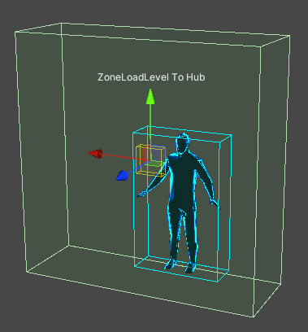
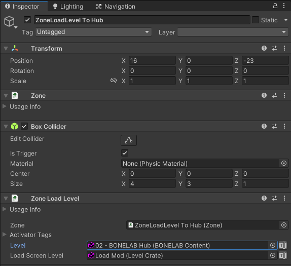

#  Zone Load Level

 <a href="https://www.youtube.com/watch?v=mckRH8cNSRU">Zone Events and Level Loading Tutorial Video</a> 

## Zones with Zone Load Level

Zone Load Level triggers a level change when a valid activator (usually the player) enters the collider volume.  

- The Load Screen Level field specifies the "loading screen" area the player will see during the level loading process.  This is recommended to be a very visually simple, small, low-asset, walled-in area that prevents the player from falling.  It should display some form of loading progress status or a simple image or animation to convey the level load process.  The External BONELAB Core Pallet (available once your game install has been set in the Marrow SDK) includes the "Load Mod" and "Load Default" Level Crates for this purpose.

- The Level field accepts any Level Crate found in the Asset Warehouse.

