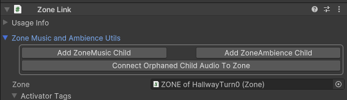
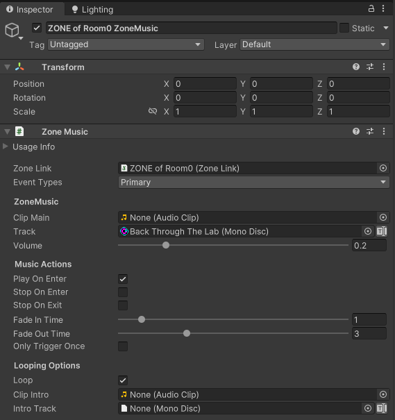

#  Zone Music

 <a href="https://www.youtube.com/watch?v=mymCH_LsDfA">Zone Music and Zone Ambience Tutorial Video</a> 

## Zones Links and Zone Music

Zone Music is a Zone Link Item that plays an audio track when an activator triggers the Zone Music's Zone Link.  Under most circumstances, the Event Type should be left as Primary.  The Zone Music component can handle typical Unity audio types, like .wav, .ogg and mp3 in its <i>Clip Main</i> field.  Additionally, with the External `BONELAB Content`  Pallet added in the Asset Warehouse (see Getting Started), all of the music from the game will be available in the form of MonoDisc Datacards, which can be set in the <i>Track</i> field.  You can also create custom Monodiscs and add them to your own working pallet by selecting the working Pallet in the Asset Warehouse and choosing `Add Mono Disc`.  

You can quickly create a Zone Music by selecting a Zone Link and opening the <i>Zone Music and Ambience Utils</i> foldout and using the `Add` buttons.  The `Connect Orphaned Child` button should rarely be needed as it is used to fix a Zone Music or Ambience component that somehow does not have the correct Zone Link field set.

- Clicking Add Zone Music Child will auto-create a Zone Music object as a child to the Zone Link and set some typical defaults.

## Usage and Considerations

By default, Zone Music is set to <i>Only Trigger Once</i> and will <i>Play On Enter</i>.  You can ensure the music track loops under the <b>Looping Options</b> section.  Hovering over any field will provide additional information and suggestions for configuring that field.  

If no other Zone Music is triggered and no Zone Music has Stop On Enter/Exit, then the most-recently triggered Zone Music continue to play even if the Activator (usually player) leaves the Zone that started the music.  

The <i>Clip Intro</i> field and its MonoDisc equivalent, <i>Intro Track</i>, allow you to play an introductory clip that fires the first time the Zone Music is triggered.  After which, the <i>Clip Main</i> or <i>Track</i> will be played.  If the Zone Music is set with Loop enabled, the <i>Clip Main</i>/<i>Track</i> portion will repeat.

### Best Practice Tip:  Set Zone Music items for every Zone
- If the same track is listed in other Zones and <i>Loop</i> is checked, but no Play On Enter/Stop on Enter/Exit boxes are checked, the current music will continue to play without interruption.  

- Keep in mind that <i>Trigger Only Once</i> applies to <i>Stop On Enter/Exit</i> options in addition to the <i>Play On Enter</i> option.  For example, if music is supposed to start every time the player enters `Zone On`  and stop any time they enter `Zone Off`, if the `Zone On` Zone Music has its <i>Trigger Only Once</i> option <b>disabled</b> but the `Zone Off` Zone Music has its <i>Trigger Only Once</i> <b>enabled</b>, then repeat visits of those Zones will only stop the music <b>one time</b>.  If the player enters `Zone On` any time after the `Zone Off` has been triggered, the `Zone On` music may unintentionally play forever.

