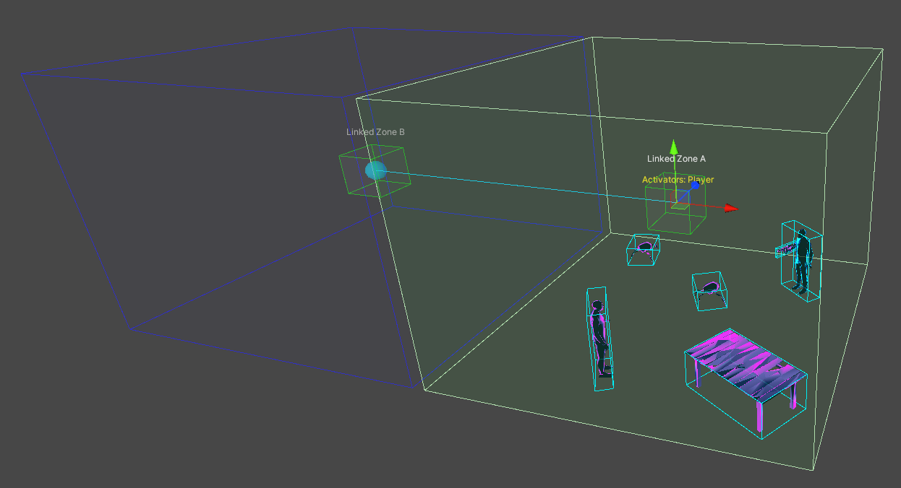

#  Zones

 <a href="https://www.youtube.com/watch?v=aInvTXv78rE">Zone Basics and Permissions Video</a> 

#### Adding different components to Zones, like the Zone Link, Zone Events or Zone Load Level component, will track different enter and exit events and provide activation permissions for those events.

#### Zone Link Items, like Zone Music and Zone Ambience, listen for Zone Link events, like starting or stopping a music track.

#### Zone Items, like Zone Events, listen for Zone events and trigger an action when activated, like enabling a realtime light to indicate an " alert" status, disabling a "forcefield" barrier or calling the SpawnSpawnable() method on a manual Crate Spawner.

## [Zones with Zone Links](ZoneLinks.md)
Zones with Zone Links track the player and any entities within their bounds as they move throughout the level and convey events to their linked neighbors using Primary and Secondary event types.  

- A **Primary** Zone link event occurs when a valid activator, like the player, enters or exits the current Zone. When this happens, any Zones that are linked to the Primary Zone experience a **Secondary** activation event.  

- This chain of events provides many gameplay and performance-related functions, like ensuring that enemies and items don’t suddenly appear or disappear in front of the player as they traverse the level.  

## [Zones with Zone Events](ZoneEvents.md)
Used to trigger events and actions

## [Zones with Zone Load Level](ZoneLoadLevel.md)
Used to trigger a level change

### Setting Zone Permissions with Activator Tags
Zone Links, Zone Events and Zone Load Level use Activator Tags to define a set of permissions for activating the Zone.  Activators can be Bone Tag Data Cards.  DataCards are digital content that references things like the Player or a music track.  Activators can also be a Crate, which make up the physical content in Marrow, like spawnables.  Bone Tag and Crate Activators can be mixed using AND/OR logic.

#### Examples: 
 - The default Activator Tag for a Zone with a <b>Zone Link</b> is the Player, ensuring only the player will trigger it.  Enemies or items passing into its bounds will have no effect.
 - A Zone with a <b>Zone Event</b> that uses no BoneTags, an Operator of <i>AND</i> but has a <i>MK18 Holosight Spawnable</i> listed in its Crates section, will only activate if a MK18 Holo enters its bounds.  
 - Normally, Crate Spawners auto-fire when the Linked Zone they reside in gets activated.  To override this, a <b>Zone Event</b> with the Player BoneTag Activator can be used to activate a Crate Spawner manually.  First, set the Crate Spawner to Manual Mode.  Then, add the Crate Spawner to the Zone Event's <i>On Zone Enter</i> section and give it the action of <i>SpawnSpawnable()</i>.  Now, the Crate Spawner will only be activated when the Player triggers the <b>Zone Event</b>, not when entering the Linked Zone associated with the Crate Spawner.
 - A Zone Load Level with the Activator of Player sends them back to the BONELAB Hub at the end of an intense boss battle.

## [Creating Zones with Zone Links](ZoneLinks.md)

## [Creating Zones with Zone Events](ZoneEvents.md)

## [Creating Zones with Zone Load Level](ZoneLoadLevel.md) 
