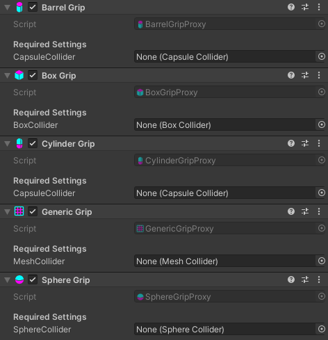

# Grips
Grips allow the hands to interact with objects by grabbing them, the assigned collider may be a trigger for different sizes

* Barrel Grip
   * Grip that emulates grabbing a large barrel, allows edge grabbing. Requires a Capsule Collider to be assigned (Recommended as trigger)
* Box Grip
   * Simple box-type grip. Requires a Box Collider to be assigned
* Cylinder Grip
   * Cylindrical grip that allows free rotation on one axis and movement on another. Requires a Capsule Collider to be assigned **(Needs to be set to z-axis)**
* Generic Grip
   * Grip that allows any mesh type to be grabbed. Requires a Mesh Collider to be assigned
* Sphere Grip
   * Grip that emulates a ball, allows free rotation around it. Requires a Sphere Collider to be assigned
* Target Grip
   * Grip with custom handposes, allowing for more unique hand interaction. Does not require a collider to be assigned (TBD!)

