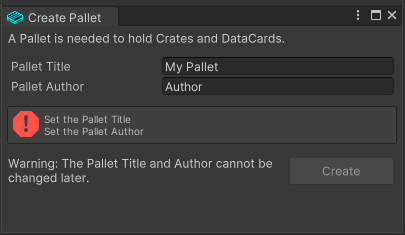
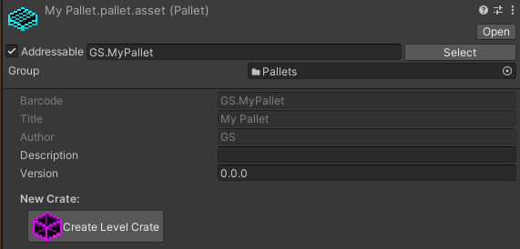
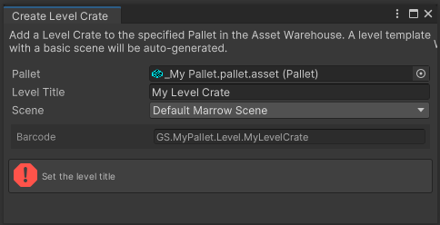
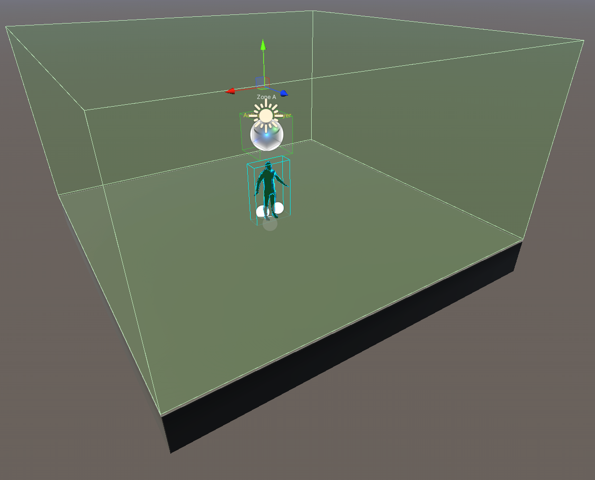
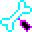
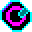

# Marrow Mod Structure: Pallets and Crates

Marrow SDK content is organized into Pallets that contain one or many Crates of various types.  Crates represent the physical content of the game, like Avatars, Spawnables and Levels.  Pallets can also contain Data Cards, which are digital content, like BoneTags that provide a way to reference the player or Mono Discs, which refer to music tracks.  

External Pallets allow a project to refer to other Pallet content as a dependency without having to include the files directly in the project.  

- For example, the BONELAB Content Pallet, which becomes available after the BONELAB install folder has been auto-detected or set, will provide the SDK access to all of the vanilla BONELAB Level, Avatar and Spawnable content and the full array of Data Cards, like Mono Discs of the entire BONELAB soundtrack.  This content can be used in creating levels without ever needing to include the actual files in your SDK project.

#  Pallets 

Creating a Pallet is a recommended first step when beginning a new project.

- Open the Asset Warehouse with the Asset Warehouse button in the upper-left of the Unity window.

- Click the Create Pallet+ button and fill out the fields in the `Create Pallet` window that appears.

- Fill out the `Pallet Title` and `Pallet Author` fields and select `Create`.

#  Crates

Each Crate holds a single object that represents the physical content of the game: 
- **Level**: The Unity Scene containing the geometry, materials, sounds, lighting, triggers and events that comprise the environment.
- **Spawnable**: A weapon, an enemy NPC, a destructible box, etc.
- **Avatar**: A properly rigged player model that changes the appearence, strength and size of the player.

#  Data Cards

Data Cards represent digital content in the game:
- **Bone Tags**: References to the Player and other objects.  Used by [Zones](./Zones.md) and the Activator Tags permissions system.
- **Mono Disc**: Music and ambience tracks

## Create a Level Crate

- Select your `Working Pallet` in the Asset Warehouse.  
- In the Pallet's inspector, click the `Create Level Crate` button.  

- In the `Create Level Crate` window that appears, set the `Level Title`.  

Leaving the other options as defaults, this will auto-generate a basic Unity Scene from the Marrow Scene Template that includes all of the basic essentials for a level, including lighting, light probes, Reflectioon Probes, Zones, Baked Volumetric Fog and the Player Marker.  This serves as a good starting point allowing you to focus on adding geometry, lighting, sound, music, spawnables and other creative aspects level design.

If you already have a .unity scene file that you want to the Level Crate to use, you can use the drop-down menu to select `Custom Scene` and then set the Scene field that appears.

- Click `Create`

##  Types of Crates

### -  [Spawnable Crate](Spawnables.md)

### -  [Avatar Crate](Avatars.md) 

### -  [Level Crate](Levels.md) 

##  Types of Data Cards

### -  [BoneTags](BoneTags.md)

### -  [Mono Discs](MonoDiscs.md) 
