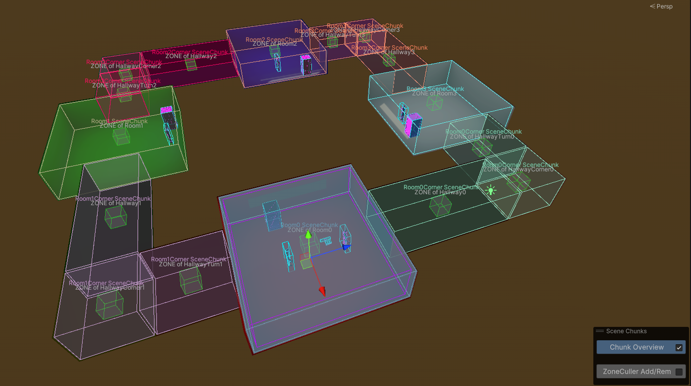
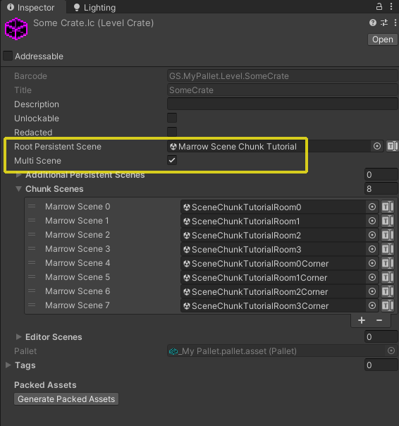
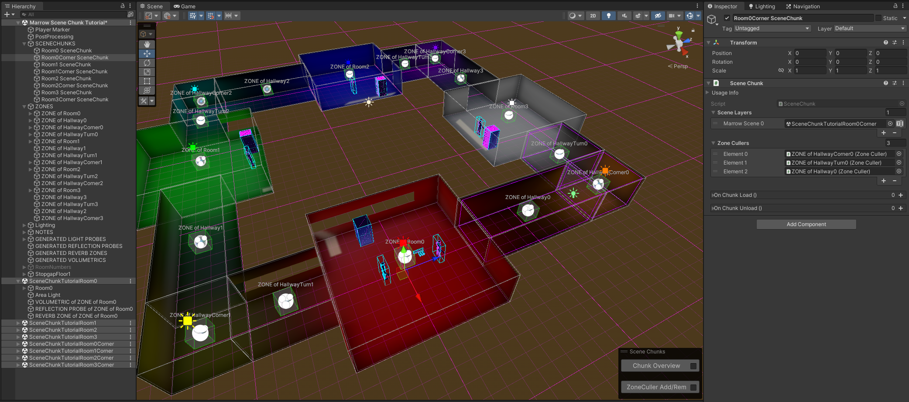

#  Scene Chunks

 <a href="https://youtube.com/watch?v=u9z4fNoYrY0">Scene Chunks Tutorial Video</a> 

Scene Chunks are an advanced topic and may require some experimentation to gain a full understanding of their use.  However, they are one of the most powerful tools at the level designer's fingertips and can unleash creativity, fidelity and performance not possible with a single scene level.

The Scene Chunk dynamic multi-scene streaming system allows level designers to carve a level into several smaller scenes.  Scene Chunks, Zones, Zone Cullers and Zone Chunk Loaders are used to define which scenes will be loaded around the player and will dynamically stream in new parts of the level as the player traverses through it and streams out any scenes that the player can no longer see or reach from their current zone.

The Scene Chunk system is aggressive in putting all geometry, entities and assets into a dormant state.  Even the physics state of an object is frozen and stored when an object streams out, ensuring the most minimal resource usage possible.

The Level Crate's inspector has a <b>Muti Scene</b> option that enables the Scene Chunk streaming system for the level.</b>

<b>The Root Persistent Scene</b>

Any items that should never be put into a streamed out or dormant state should reside in the <b>Root Persistent Scene</b>.  This scene is <i>always loaded</i> and should contain items like the Player Marker, Scene Chunks, Zones, Zone Music/Ambience, CrateSpawners and any Post Processing effects.  Additionally, GameObjects with global properties or that would be visible across most, if not all scenes (like the level's sky and the Directional Light), should reside in the Root Persistent Scene.  Light Probe data is shared across all scenes that are baked together, so even if Light Probe Groups are organized across scenes, the data they generate will be aggregated.  

<b>Additive Scenes</b>

Static geometry, Baked Lights and Reflection Probes should be moved to seperate additive <b>"Chunk Scenes"</b>.  These scenes will be streamed in and out based on the player's current Zone and its Zone Chunk Loader component that lists which Scene Chunks should be loaded while that Zone is active.   The <i>Chunks</i> list on the Zone Chunk Loader component should contain the current Scene Chunk and any other Scene Chunks that share <b>line of light</b> with the current one.  

<b>Quickly Populating Scene Chunk and Zone Chunk Loader Fields</b>

- Once a Scene Chunk componenet exists in a level, the Zone Creation tools will automatically add Zone Chunk Loader components to any new Zones. (Existing Zones will need to be updated manually.)

- Whenever a Scene Chunk is selected, a contextual overlay will appear in the lower-right of the Scene view.  The Add/Rem ZoneCullers toggle will display handles in the Scene view that will allow you to quickly add ZoneCullers to the Scene Chunk Zone Cullers list in an intuitive way.

- When a Zone Chunk Loader is selected, locking the inspector and using the buttons on the component to Add or Overwrite its Chunks list.

<b>Cautions and Considerations</b>

CrateSpawners not in the Root Persistent Scene will activate any time their Scene Chunk is streamed in <i>and</i> will deactivate any time their Scene Chunk is streamed out.  This usually has unintended consequences, like an enemy suddenly disappearing if the Scene Chunk that their CrateSpawner resides in is culled.  The CrateSpawned entity will be despawned <i>regardless of where they physically are in the level</i> at the very instant the scene that holds the CrateSpawner streams out.  If the scene is streamed back in, a new entity will respawn at the CrateSpawner.

In contrast, enemies and items from Crate Spawners that reside in the <b>Root Persistent Scene</b> will simply be <b>frozen</b> if they are in a Scene Chunk that is culled.  However, if they move into a new Scene Chunk, they will remain active even if the scene with their CrateSpawner is culled.  Keep these considerations in mind when designing combat areas.

Scenes and Scene Chunks do not need to be small.  For example, <b>Big Anomaly</b>, <b>Street Puncher</b> and <b>Sprint Bridge</b> are single scene levels.  <b>Ascent</b> is a <i>Multi Scene</i> level.  One of its chunks contains the entire "forest" vertical climbing, combat, ziplining and gravity tether sections and ends at the "Staff Only" door.

<b>Summary</b>

- Scene Chunks are enabled by enabling the <i>Multi Scene</i> toggle in the Level Crate's inspector.

- The <b>Root Persistent Scene</b> is always active and should hold the Player Marker, Zones, Zone Music/Ambience, CrateSpawners, SceneChunks, the sky, Directional Light, Light Probes and any other items that tend to be globally in view.

- <b>Scene Chunks</b> contain a Scene Layers list that holds the scene or scenes of that Scene Chunk.  These additive scenes typically hold static geometry, baked lighting, Reflection Probes, Reverb Zones and Baked Volumetrics.  Crate Spawners residing in additive scenes may yield unexpected results.

- <b>Zone Cullers</b> listed in the Scene Chunk component define the areas that should be culled as the scene is streamed out.  Spawned entities being tracked by these culled Zones are frozen (assuming their Crate Spawner resides in the Root Persistent Scene's hierarchy), freeing up physics and AI performance.  Static geometry and lighting is hidden, freeing up rendering resources.

- <b>Zone Chunk Loaders</b> define what Scene Chunks should be loaded whenever the current Zone is active.  Populating this list with Scene Chunks that would be in the player's <b>line of sight</b> ensures that neighboring scenes get loaded so that geometry and entities do not seem to suddenly pop in or out of existence.