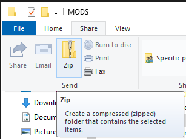

# Sharing Marrow SDK Content

Is your Marrow content finalized, tested and ready to be shared with the world?

## Preparing Marrow Content for Mod.io

Mod.io is one of the major repositories the community uses to host mod content.

Click `Pack for PC` or `Pack for Quest` to pack your Marrow content and prepare it for distribution. 

When the Pack process compleltes, a File Explorer window will appear with a folder named with the following format:  [Author].[PalletName].  

Select this folder (do not open it) and then, in the **File / Home / Share / View** menu in the Windows File Explorer, click the **Share** tab.

Click the **Zip** button to compress this folder and all of its contents into a single zip file with its folder structure intact.  This file is what should be uploaded to distribution sites like Mod.io.