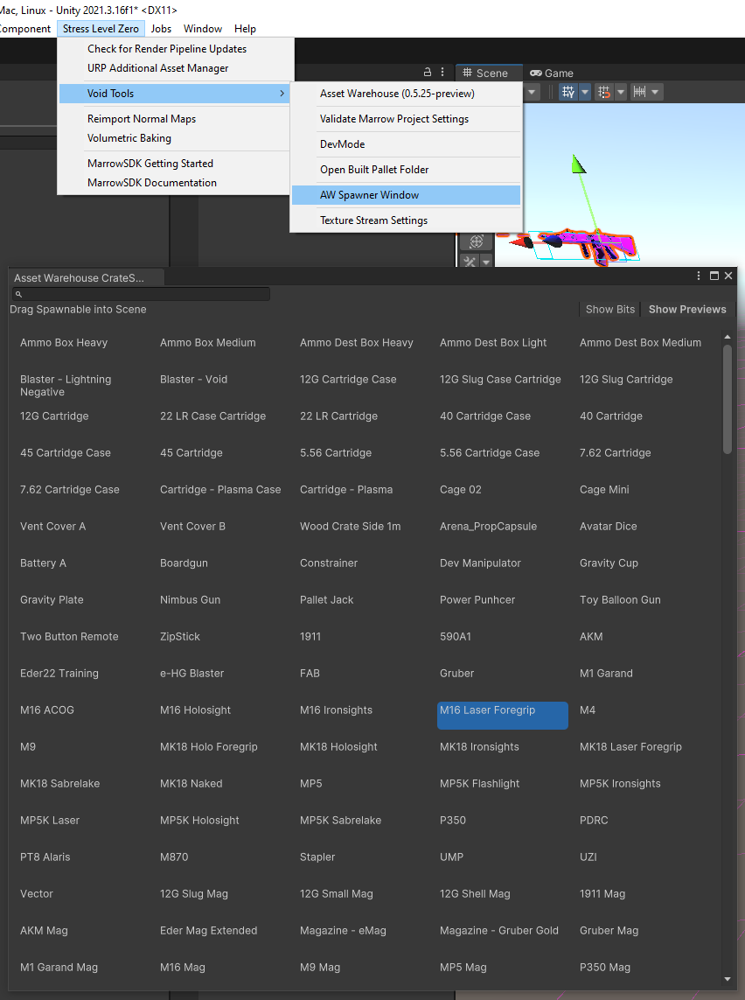

#  Spawnable Crate
Spawnable Crates are physical objects that have at least one rigidbody and can be spawned from the aptly named CrateSpawner component.  

### Accessing BONELAB Spawnables Content

If the Marrow SDK has correctly detected your BONELAB install location, then the Asset Warehouse will automatically be populated with the External Pallet: `BONELAB Content`, allowing for any vanilla BONELAB content to be included in your project.

- See the [Getting Started](Home.md#getting-started) section for details if you have any game install discovery issues.

### Creating Custom Spawnables is not currently supported.

## Adding a CrateSpawner to the Level

### Best Practice Tip: CrateSpawners should be children of the Zones that spawn them.

#### First Method - Drag & Drop Overlay

Ensure the Asset Warehouse Spawner Overlay is visible in the Scene view.  If the Overlay is hidden, press **Spacebar** and the select `AW Spawner` from the list of overlays to reveal it.

0. On first use, the AW Spawner must be Initialized.  Click the Initialize Overlay button.
1. Select the Spawnable you want to add to the scene using the list in the `AW Spawner`.
2. Drag directly from the list of Spawnables or use the Spawnable icon at the bottom of the `AW Spawner` overlay and Drop into the Scene where you want to place the item.  This method will automatically add the Spawnable Crate Placer component and fill the `Spawnable Crate Reference` field.
3. If the  CrateSpawner is placed within the bounds of a Zone, it will become a child of that Zone automatically.  Otherwise, adjust the hierarchy so the CrateSpawner is a child of the linked Zone in which it resides.

#### Second Method - Drag & Drop Window

Use the `Stress Level Zero -> Void Tools -> AW Spawner Window` menu to show the window.

0. On first use, the AW Spawner Window must be Initialized.  Click the `Initialize Overlay` button.
2. Drag directly from the list of Spawnables and Drop into the Scene where you want to place the item.  This method will automatically add the Spawnable Crate Placer component and fill the `Spawnable Crate Reference` field.
3. If the  CrateSpawner is placed within the bounds of a Zone, it will become a child of that Zone automatically.  Otherwise, adjust the hierarchy so the CrateSpawner is a child of the linked Zone in which it resides.

#### Third Method - GameObject menu

1. Select `GameObject -> MarrowSDK -> Crate Spawner` from the menu.
2. Open the selection picker using the circle button to the right of the `Spawnable Crate Reference` field and select the desired Spawnable.
3. Adjust the CrateSpawner in the hierarchy so it is a child of the linked Zone in which it resides.

#### Optional: If the Crate Spawner should not automatically trigger when an activator (usually the player) triggers its Zone Link, set the Crate Spawner to `Manual Mode` and set up a [Zone Event](ZoneEvents.md).  