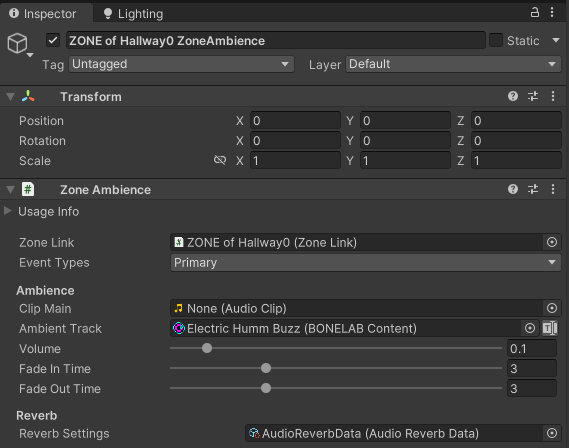

#  Zone Ambience

 <a href="https://www.youtube.com/watch?v=mymCH_LsDfA">Zone Music and Zone Ambience Tutorial Video</a> 

## Zones Links and Zone Ambience 

Zone Ambience is a Zone Link Item that plays a looping audio effect that adds auditory atmosphere to the level.  Zone Ambience gets played when a valid activator triggers the Zone's Ambience's Zone Link.  

You can quickly create a Zone Ambience by selecting a Zone Link and opening the <i>Zone Music and Ambience Utils</i> foldout and using the `Add` buttons.  The `Connect Orphaned Child` button should rarely be needed as it is used to fix a Zone Music or Ambience component that somehow does not have the correct Zone Link field set.

Under most circumstances, the Event Type should be left as Primary.  The Zone Ambience component can handle typical Unity audio types, like .wav, .ogg and mp3 in its <i>Clip Main</i> field.  Additionally, with the External `BONELAB Content`  Pallet added in the Asset Warehouse (see Getting Started), all of the music from the game will be available in the form of MonoDisc Datacards, which can be set in the <i>Ambient Track</i> field.  You can also create custom Monodiscs and add them to your own working pallet by selecting the working Pallet in the Asset Warehouse and choosing `Add Monodisc`.  

Reverb Settings can be applied to the Zone Ambience using an `Audio Reverb Data` scriptable object.  Several data templates that provide a wide range of soundscapes are available in the Marrow SDK, from the tight echos of a small metallic space to a large concrete room.  If none are suitable, custom `Audio Reverb Data` objects can be created using the Assets -> Create -> Stress Level Zero -> Audio Reverb Data menu.  By default, custom Audio Reverb Data scriptable objects are created in the working pallet’s root file folder.

Note that the Zone Ambience’s Reverb Settings make Unity’s built-in Reverb Zones unnecessary and redundant.

## Usage and Considerations

- Zone Ambience will automatically loop forever even after the activator (player) leaves the triggering Zone.  The Ambient Track will continue until another Zone Ambience is triggered.   
- It is highly recommended to layer ambience throughout all parts of your level to add depth and character to it.  However, if you really need ambient audio to be silent after a Zone Ambience has been triggered, simply add a Zone Ambience where you need silence, give it a valid <i>Ambient Track</i> and then set the <i>Volume</i> to zero.

### Best Practice Tip:  Set Zone Ambience items for every Zone
- If the same track is listed in other Zones, the current Ambient Track will continue to play without interruption.  