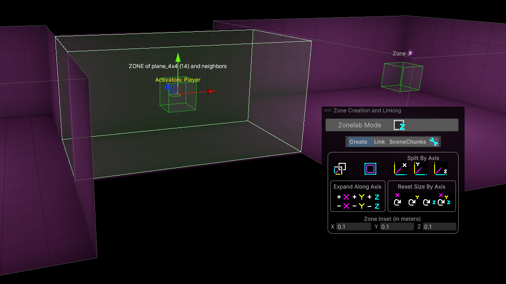
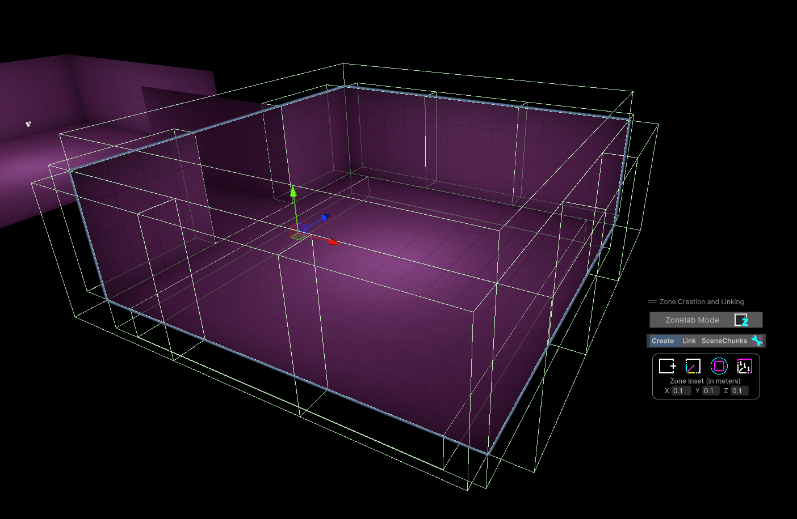
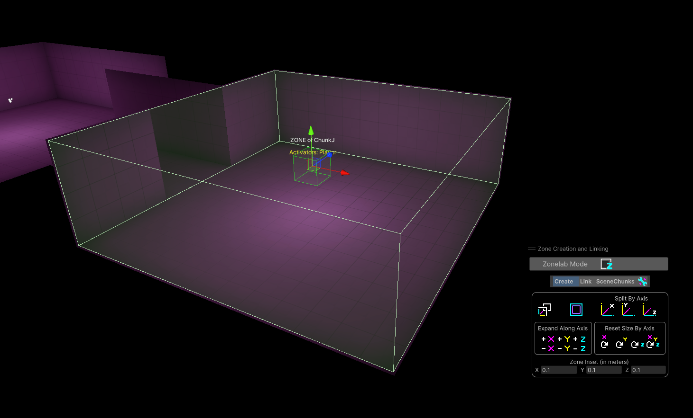
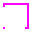
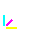
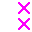
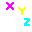
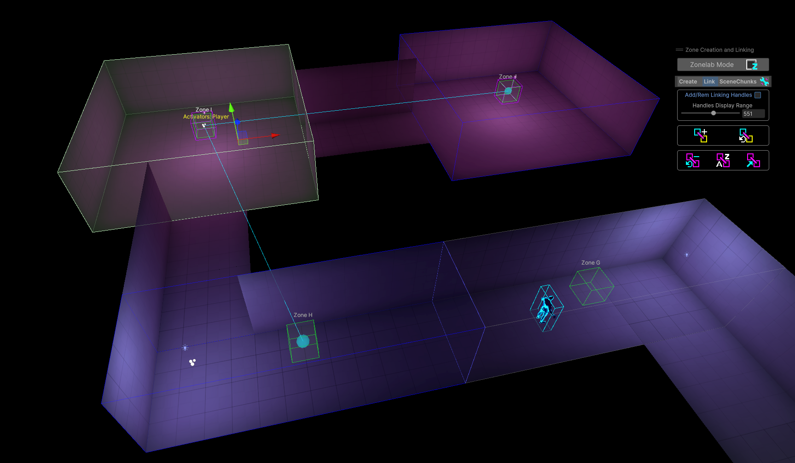
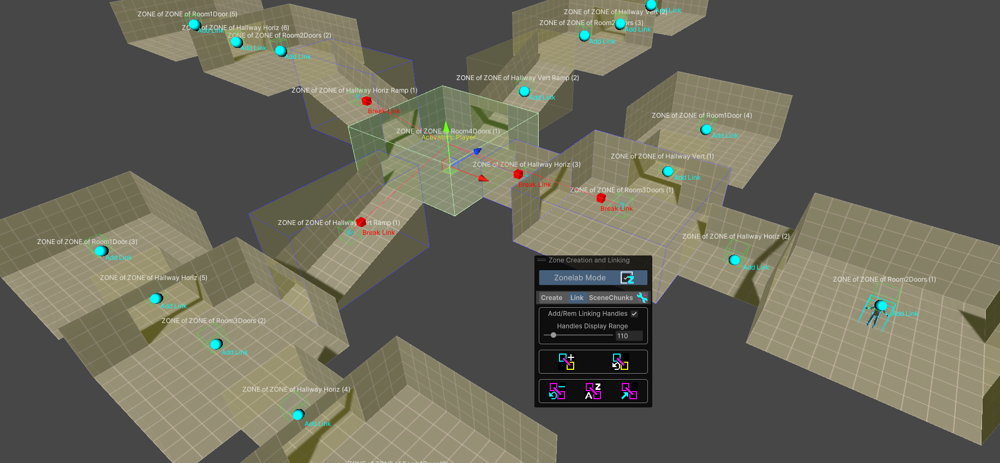

#  Zone Links

 <a href="https://www.youtube.com/watch?v=6eQvmlrKb_k">Zone Creation and Linking Tutorial Video</a> 

## Creating Zones with Zone Links

- Click anywhere in the Scene to give it focus and then press SPACEBAR to bring up the Unity Overlays menu.
- Select the <b>Zone Creation and Linking</b> Overlay.

### Required Practice: <i>Unique Naming</i> 
- Zones with Zone Links need to be uniquely named.  The tools try to prevent duplicate Zone names by basing the name of a Zone on the geometry that is used to create the Zone.

### Best Practice Tip: <i>Zone Inset</i> 
- A Zone Inset value is used to automatically shrink the size of a Zone slightly so that Zones do not extend through the walls, floors, ceilings oof the geometry that surrounds them.  This prevents any Zone overlap that might potentially trigger unintended entity enter/exit signals without having to tweak Zone sizes through tedious manual adjustments.

 <b>Geo Bounds</b> - Clicking this button will create a Zone with a Zone Link for each piece of selected geometry that are sized to the bounds of each geometry object.

Example: Create two 3D primitive cubes in Unity using the GameObject -> 3D Object -> Cube menu.  Move them slightly apart so both are easily visible.  Select both Cubes.  Click the Geo Bounds button.  This will create two Zones with Zone Links that will be sized to exactly fit each 3D Cube <i>minus the Zone Inset value</i>.  If Zone Inset was set to 0,0,0, the Zones would exactly match the dimensions of each cube.

 <b>Geo Dimensions</b> - This button will create a single Zone with a Zone Link that is sized to surround all of the currently selected geometry objects.

 

 <b>Encapsulate Children</b> - Clicking this button will create a Zone with a Zone Link that encapsulates the child geometry for each selected parent GameObject.

 

Example: Several pieces of geometry and their colliders are collected under one empty GameObject parent.  Selecting the parent GameObject and clicking the Encapsulate Children creates a single Zone with a Zone Link that encompasses all child geometry.  If multiple parents were selected, each would produce their own Zone with bounds that surround the child geo of each parent.

 <b>Default Zone</b> - This button will create a Zone with a Zone Link of 1x1x1 dimensions at the position of the selected GameObject.  This tool is intended to be used along with the Zone Editing functions.

## Editing Zones

It is ideal to create Zones that are sized to the geometry that surrounds them but are slightly inset to ensure Linked Zones do not overlap with other Linked Zones.  Whenever a Zone is selected, the <b>Zone Creation and Linking</b> Overlay will switch to Edit mode to help with any needed resizing tasks.  While manually editing the colliders of the Zone is supported, the following tools try to automate away as much of the tedium from the process as possible.

 <b>Fit to Neighbors</b> - A Ray will be cast from the <b>Transform point</b> of the Zone and attempt to expand the Zone's bounds until static geometry or a neighboring Zone with a Zone Link is hit.  For best results, position the Zone's transform such that rays shot from its position will hit the geometry or neighbor Zones that will limit its size.  

 <b>Manual Collider</b> - Simply turns on Unity's typical Collider edit mode, allowing you to manually drag and resize the collider bounds.  

 <b>Split by Axis</b> - Splits the Zone in half along the chosen axis and leaves behind two Zones.

  <b>Expand by Axis</b> - Expands the Zone along the chosen axis until it hits static geometry or a neighboring Zone.

 <b>Reset Size by Axis</b> - Resets the selected axis  of the Zone to 1 meter.

## Linking Zones
### Best Practice Tip: Link Zones based on <i>Line of Sight</i>
- Linking zones based on Line of Sight will prevent objects and enemies from seeming to pop in and out of existence in front of the player.  Usage of the Nimbus Gun should be taken into account when deciding if the player has Line of Sight to another Zone.  

Example: In the screenshot above, Zone I is selected.  It is currently linked with Zone J and Zone H (Colliders shown with blue outlines and cyan link lines connect the Zones to show their linked relationship).  Zone I is not linked with Zone G because the player will never have any Line of Sight from Zone I to Zone G.  While the player is in Zone I, there is no reason to track the entities in the unlinked Zone G.  

###  Quality of Life Tip: Toggle on <i>Zonelab Mode</i> when Linking Zones  
- Zonelab Mode will make it so <i>only</i> Zones are pickable in the Scene view.  This can drastically speed up the linking process because you won't have to fight to avoid selecting geometry or other items as you navigate the zone linking process.  Unselected Zone bounds will also be highlighted in yellow so they are visible even when not selected.

### Adding or Breaking Links
By default, the Add Link and Break Link handles will appear when the Zone Overlay tools are set to Link mode.  Selecting a Zone will show any current link relationships and provide a handle in the Scene view that will break the link when clicked.  Any Zones that are not linked with the selected Zone will display an Add Link handle.  If multiple Zones are selected, the Add or Break Link handles will add or remove a link relationship with <i>all currently selected Zones</i>.

 <b>Add Links to Selected</b> - This button is useful when multiple Zones are selected and you want to Add all of selected Zones to each other but keep any other link relationships untouched.  

 <b>Overwrite Links with Selected</b> - This button simply overwrites the Zone Links list of any selected Zones with the current selection of Zones.  Once clicked, Zones will be linked with each other and nothing else.

Example: Given the <i>Line of Sight</i> best practice for linking Zones, the screenshot above would look like this with the same Zone selected in a properly-linked level.  The ramps are not tall enough to block the player's view into the raised and lower sections, so from this central junction, a large number of zones must be linked to it to ensure enemies or other spawnables do not pop in or out of existence as you look down the hallways.

### Watch the Zone Linking Video Tutorial for a detailed walkthrough of the Zone Linking process
- ToDo - add YT link to Zone Linking tutorial

### Review Zone Permissions 
Zone Links use Activator Tags to define a set of permissions for activating the Zone.  Activators can be Bone Tag Data Card.  Data Cards are digital content that references things like the Player or a music track.  Activators can also be a Crate, which make up the physical content in Marrow, like spawnables.  Bone Tag and Crate Activators can be mixed using AND/OR logic.

### Zone Music and Zone Ambience

Zone Music and Zone Ambience use the Zone Links system to add auditory texture to your level.  The Zone Link component has buttons to quickly create new Zone Music or Zone Ambience objects.

### Learn more about
- ### [Zone Music](ZoneMusic.md)
- ### [Zone Ambience](ZoneAmbience.md)